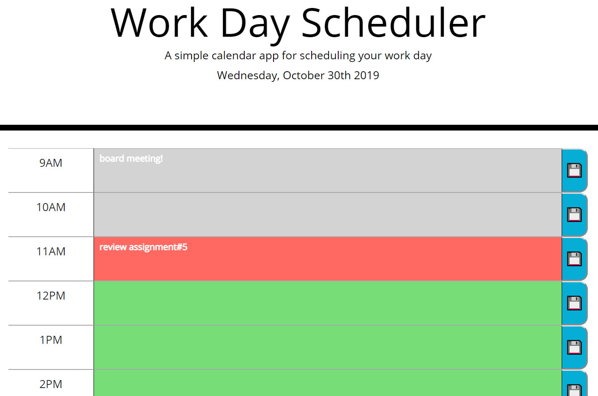

# Unit 05 Third-Party APIs Homework: Day Planner

## Description

This project provides users with a daily planner where they can add their own events to an hourly log for the business hours of 9am-5pm. The planner results in effective time management and greater productivity as users' can easily plan their day ahead. 

## The final product
 https://wendyhub.github.io/day-planner/

 

